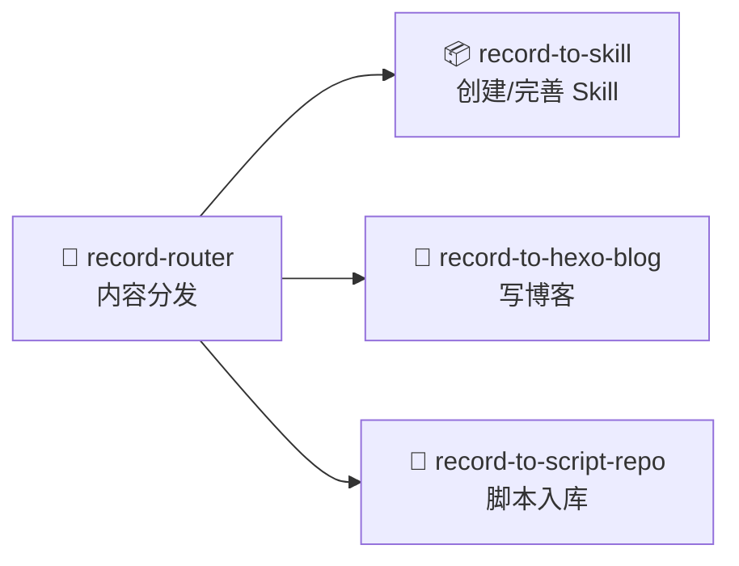
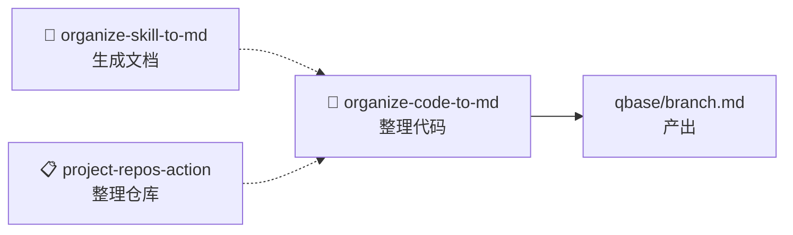
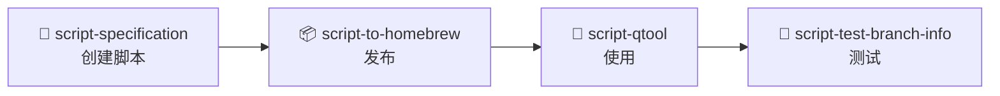
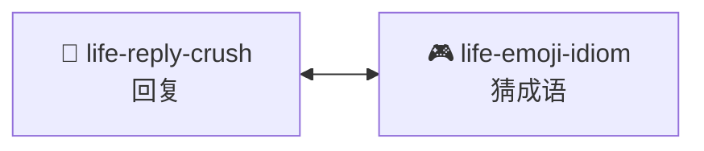
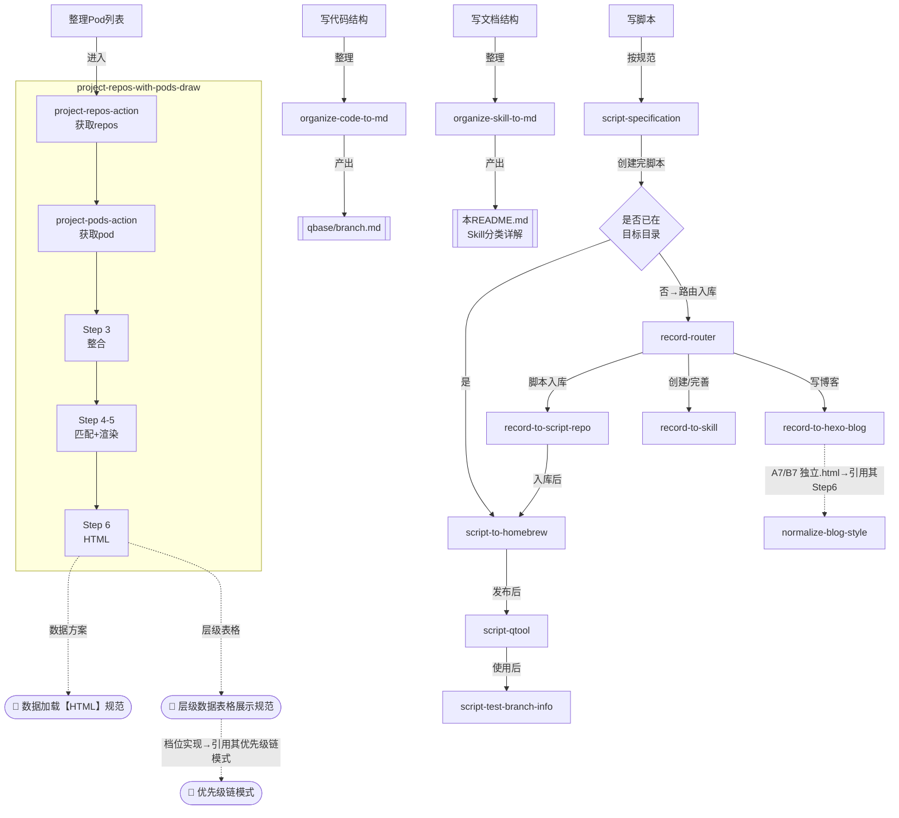

# AI-qskills
自定义的 Skill 工具集合

**所有 Skill 的完善遵从 [record-to-skill 的 SKILL.md](./record-to-skill/SKILL.md)**，通过输入**"完善我的skill"**即可触发，**优化skill，可生成结构文档**


## Skill 分类详解

---

### 📝 内容记录



| Skill | 描述 | 触发场景 | 产出示例 |
|-------|------|----------|----------|
| [record-router](./record-router) | 内容分发路由 — 判断内容类型，路由到对应 Skill | "记录这个"、"保存这个" | 路由到博客/Skill/脚本库 |
| [record-to-skill](./record-to-skill) | 创建和完善 Skill | "创建skill"、"完善我的skill" | SKILL.md |
| [record-to-hexo-blog](./record-to-hexo-blog) | 将内容写入 hexo 博客 | "把这个写到博客" | 博客文章 |
| [record-to-script-repo](./record-to-script-repo) | 将脚本分类入库 | "把这个脚本入库" | 脚本放入正确仓库 |

---

### 📁 内容整理



| Skill                                          | 描述                                    | 触发场景           | 产出示例                                                     |
| ---------------------------------------------- | --------------------------------------- | ------------------ | ------------------------------------------------------------ |
| [organize-skill-to-md](./organize-skill-to-md)       | 整理 Skill 关系/生成图谱                   | "整理 Skill 关系"     |                                                              |
| [project-repos-action](./project-repos-action) | 整理仓库列表为分类文档                  | "整理仓库"         | 项目列表.md                                                  |
| [organize-code-to-md](./organize-code-to-md)   | 整理代码目录结构                        | "帮我理下有关 XXX" | [qbase/branch.md](https://github.com/dvlproad/qbase/blob/main/branch.md) |

---

### 📝 脚本相关

**关系**: 流程链



| Skill | 描述 | 触发场景 | 产出示例 |
|-------|------|----------|----------|
| [script-specification](./script-specification) | 帮助创建符合统一要求的脚本 | "创建脚本" | |
| [script-to-homebrew](./script-to-homebrew) | 将脚本整合到 qbase 库 | "整合到qbase" | 发布qbase |
| [script-qtool](./script-qtool) | 操作 CQCI 工具集 | 包含 "script-qtool" 的指令 | |
| [script-test-branch-info](./script-test-branch-info) | 测试分支信息 | "测试分支信息" | |

---

### 🔧 功能模块
| Skill                                                  | 描述                                        | 触发场景       | 产出示例   |
| ------------------------------------------------------ | ------------------------------------------- | -------------- | ---------- |
| [dev-fw-setting-ai-models](./dev-fw-setting-ai-models) | AI应用通用架构，包含模型选择、API Key管理等 | "创建 AI 网页" | AI聊天应用 |
| [project-repos-with-pods-draw](./project-repos-with-pods-draw) | 整合 repos+pod 数据，渲染为项目列表 | "生成项目列表"、"渲染项目列表" | repos_with_pods.json + 项目列表.md/html |
| [opencode-sessions-manager](./opencode-sessions-manager) | opencode 会话自动记录与恢复 | "配置opencode会话管理" | source_opencode.sh + ~/Downloads/我的会话id.md |
---

### 💬 创意娱乐



| Skill                                  | 描述                           | 触发场景     | 产出示例          |
| -------------------------------------- | ------------------------------ | ------------ | ----------------- |
| [life-reply-crush](./life-reply-crush) | 生成幽默撩人、有情绪张力的回复 | `crush: xxx` | crush: 今天忙啥呢 |
| [life-emoji-idiom](./life-emoji-idiom) | 根据emoji符号猜成语            | "猜成语"     | 🙄🐯🧧🏮              |


---

## 在 ChatGPT 等中使用

提示词如下：

**开头：复制文档标题之后内容**

**过渡**：

> 以后我输入 "crush: xxx" 的格式，你就直接生成回复。

或

> 以后我说"猜成语"或发送emoji图片，你就帮我猜成语。

**结尾：明白请回复"明白"**


---

## 安装到 OpenCode

### 方式一：Plugin 方式（推荐）

参考：https://github.com/obra/superpowers

告诉 OpenCode：
```
Fetch and follow instructions from https://raw.githubusercontent.com/dvlproad/AI-qskills/refs/heads/main/.opencode/INSTALL.md
```

或者在 `opencode.json` 中添加：

```json
{
  "plugin": ["ai-qskills@git+https://github.com/dvlproad/AI-qskills.git"]
}
```

### 方式二：手动软链接（简单）

```bash
# 注意：原文件不能使用相对路径，会导致无法正确链接，及显示原身失败，必须使用绝对路径
# 注意：原文件不能使用相对路径，会导致无法正确链接，及显示原身失败，必须使用绝对路径
# 注意：原文件不能使用相对路径，会导致无法正确链接，及显示原身失败，必须使用绝对路径

# 克隆仓库后链接整个 AI-qskills 目录（必须使用绝对路径）
ln -s "/Users/用户名/Project/AI/AI-qskills" ~/.config/opencode/skills/ai-qskills

# 或者链接单个 skill
ln -s "/Users/用户名/Project/AI/AI-qskills/life-reply-crush" ~/.config/opencode/skills/life-reply-crush
```


---

## 开发新 Skill

1. 在 `AI-qskills/` 目录下创建新的 skill 文件夹
2. 文件夹内必须包含 `SKILL.md` 文件，格式如下：

```yaml
---
name: skill-name
description: |
  技能描述，说明什么时候触发这个技能
---

# 技能内容
```

3. 更新 `.opencode/plugins/ai-qskills.js` 中的 `skillsDir` 配置，确保新 skill 被加载
4. 更新 `.opencode/INSTALL.md` 中的 Available Skills 部分
5. 在本 README.md 的 Skills 表格中添加新 skill


---

## 调用关系总览

跨分类的 Skill 调用/引用关系（仅列出有相互调用的 Skill，其余为独立 Skill）。📄 标记的为规范/方案文件，非 Skill 目录。

### 图例

| 线型 | 含义 |
|------|------|
| `-->` | **路由/流转** — 由 Skill 自身逻辑路由到下一个 Skill |
| `==o` | **脚本调用** — 调用目标 Skill 目录下的脚本文件执行 |
| `-..->` | **引用** — 实现时引用目标 Skill 的方案/模式作为基础设施 |

### 维护规则

1. **新增 Skill 后**：判断是否与其他 Skill 有调用/引用关系。有则画入流程图，加表格行；无则只在独立列表追加
2. **修改路径后**：只改连线标签，不动节点；如需插中间步骤，在目标节点前声明新节点，原连线改接到新节点
3. **保持 record-router 唯一**：`record-router` 只能出现一次，凡涉及路由入库的闭环都指向它，不复制节点
4. **线型选择**：AI 路由走 `-->`，调用脚本走 `==o`，仅引用方案/模式走 `-..->`
5. **就近原则**：同一管线的节点在声明顺序上聚在一起（如 `RSR` 紧邻脚本管线 `SH→SQ→ST`），避免同域节点分离难读

### 有引用/调用的 Skill 联动关系



### 独立 Skill（无相互调用）

- `dev-fw-setting-ai-models`
- `life-emoji-idiom`
- `life-reply-crush`
- `opencode-sessions-manager`

## 踩坑记录

### 1. `.cocoapods/repos/` 与 source 目录不同步

`pods_fetch_to_md.sh` 扫描的是 `~/.cocoapods/repos/gitee-dvlproad-dvlproadspecs/`（CocoaPods 本地缓存），但用户的手动修改是在 `~/Project/Gitee/dvlproadSpecs/`（源代码目录）。两者不是同一份文件，会导致同一 podspec 在两个目录下有不同内容。

**处理**：修改 podspec 后需要 `rsync` 到 `.cocoapods/repos/`，或者执行 `pod repo push` 更新。

### 2. `dvlproad项目列表.html` Pod 展开行缺少 `<tr>` 开标签

`renderRepoTable()` 中 pod 子行（有 Pod 的 repo 下的子表）拼接 HTML 时，只输出了 `</td></tr>` 闭合标签，缺少了 `<tr class="pod-subspec-row"><td colspan="N">` 开标签。导致有 Pod 的 repo 后的所有后续行 HTML 结构破碎，渲染为纯文本粘合在一起。

**表现**：有 Pod 的 repo（如 `001-UIKit-CQDemo-iOS`）之后的每一个 repo 行（如 `001-UIKit-CQDemo-Flutter`）全部串成一行文本，列分隔符消失。

**根因**：`colspan` 变量定义了但未用于开标签，`renderPodCompactTable()` 返回的 `<div>` 直接跟在 `</tr>` 之后，脱离了表格上下文。

**修复**：在 `renderPodCompactTable()` 前加回 `<tr class="pod-subspec-row" id="..."><td colspan="..." style="padding:0;">`，用 `hidePod` 控制初始 hidden 状态。


## 版本记录

更多版本记录想看每个 SKILL 内部的版本记录

### 0.0.9 (2026-05-21)
- **坑**: `dvlproad项目列表.html` renderRepoTable pod 子行缺少 `<tr>` 开标签，有 Pod 的 repo 后所有行 HTML 结构破碎
- 优化 [normalize-blog-style](./normalize-blog-style): 标题改为「博客风格与视觉美化」；新增 Step 14 视觉美化特效

### 0.0.8 (2026-05-12)
- **坑**: `.cocoapods/repos/` 与 source 目录不同步，需 `rsync`

### 0.0.8 (2026-05-12)
- 新增 [project-repos-with-pods-draw](./project-repos-with-pods-draw): podspec 规范化（子库注释 + description），可选同步到项目列表，还支持直接生 HTML 版项目列表（dvlproad项目列表.html），与 markdown 版同类名同目录
- 生成了 `dvlproad项目列表.html`，从 `repos_with_pods.json` 直接渲染项目列表，包含分类导航、搜索、公有/私有筛选、Pod 展示及子库详情折叠功能

### 0.0.7 (2026-05-10)
- merge organize-pod-to-md → [project-repos-with-pods-draw](./project-repos-with-pods-draw): 获取 Pod + 匹配到项目列表功能合并入 project-repos-with-pods-draw

### 0.0.6 (2026-04-25)
- 新增 [project-repos-action](./project-repos-action) skill：整理 GitHub 和 Gitee 仓库列表为分类文档

### 0.0.5 (2026-04-13)
- 新增 [record-to-skill](./record-to-skill) skill：优化和完善用户创建的 skill
- 修复 [script-to-homebrew](./script-to-homebrew) skill：修复AI执行skill中断问题，让AI可以按skill自动执行完整个流程

### 0.0.4 (2026-04-11)
- 新增 [script-specification](./script-specification) skill：帮助用户创建符合统一要求的脚本
- 新增 [script-to-homebrew](./script-to-homebrew) skill：将独立脚本整合到 qbase 库中

### 0.0.2 (2026-04-1)

- 新增 [life-reply-crush](./life-reply-crush) skill：生成幽默撩人、有情绪张力的回复，让对方笑、脸红、想继续聊
- 新增 [emoji-idiom](./emoji-idiom) skill：根据emoji符号猜成语，支持谐音法、象形法、组合法

