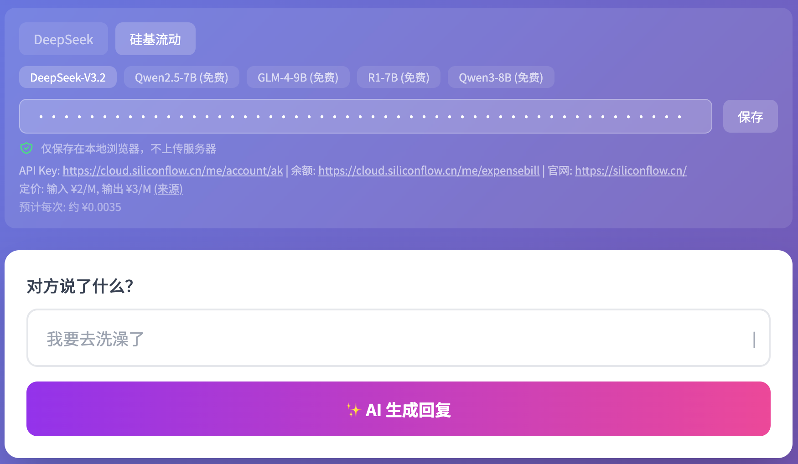

# 通用 AI 应用架构

> **参考图**: 以下为完整实现示例，仅供查看了解结构
> 

当需要创建一个新的 LLM 驱动的网页/App 时，使用此模板生成通用框架，用户后续补充核心业务功能。

## 适用场景

- 聊天回复生成器
- 文字游戏（如猜成语）
- AI 写作工具
- 问答系统
- 任何需要调用 LLM API 的应用

---

## 一、平台与模型配置

定义平台配置，包含各 AI 服务商的配置信息。

**配置项**：
- `name`: 平台显示名称
- `endpoint`: API 端点地址
- `model`: 默认模型（单模型平台）
- `models`: 模型列表（多模型平台），每个模型含 id、name、inputPerM、outputPerM、free
- `apiKeyHelp`: 帮助文本，含 API Key 获取地址、余额查询、官网链接
- `pricing`: 定价信息，含 inputPerM、outputPerM、currency、url

**模型配置项**：
- `id`: 模型标识
- `name`: 模型显示名称
- `inputPerM`: 输入定价（元/百万tokens）
- `outputPerM`: 输出定价（元/百万tokens）
- `free`: 是否免费

**必须支持平台**：
1. **DeepSeek** - https://api.deepseek.com
2. **硅基流动** - https://api.siliconflow.cn（提供多个免费模型）

**参考代码**:

```javascript
const PLATFORMS = {
    deepseek: {
        name: 'DeepSeek',
        endpoint: 'https://api.deepseek.com/v1/chat/completions',
        model: 'deepseek-chat',
        apiKeyHelp: '获取 API Key: <a href="https://platform.deepseek.com/" target="_blank">https://platform.deepseek.com/</a>',
        pricing: { inputPerM: 0.28, outputPerM: 0.42, currency: '$', url: 'https://api-docs.deepseek.com/quick_start/pricing' }
    },
    siliconflow: {
        name: '硅基流动',
        endpoint: 'https://api.siliconflow.cn/v1/chat/completions',
        models: [
            { id: 'deepseek-ai/DeepSeek-V3.2', name: 'DeepSeek-V3.2', inputPerM: 2, outputPerM: 3 },
            { id: 'Qwen/Qwen2.5-7B-Instruct', name: 'Qwen2.5-7B', inputPerM: 0, outputPerM: 0, free: true },
            { id: 'THUDM/glm-4-9b-chat', name: 'GLM-4-9B', inputPerM: 0, outputPerM: 0, free: true },
            { id: 'deepseek-ai/DeepSeek-R1-Distill-Qwen-7B', name: 'R1-7B', inputPerM: 0, outputPerM: 0, free: true },
            { id: 'Qwen/Qwen3-8B', name: 'Qwen3-8B', inputPerM: 0, outputPerM: 0, free: true }
        ],
        apiKeyHelp: 'API Key: <a href="https://cloud.siliconflow.cn/me/account/ak">https://cloud.siliconflow.cn/me/account/ak</a> | 余额: <a href="https://cloud.siliconflow.cn/me/expensebill">https://cloud.siliconflow.cn/me/expensebill</a> | 官网: <a href="https://siliconflow.cn/">https://siliconflow.cn/</a>',
        pricing: { inputPerM: 2, outputPerM: 3, currency: '¥', url: 'https://siliconflow.cn/pricing' }
    }
};
```

---

## 二、API Key 管理

**功能需求**：
- 输入框（密码类型）用于输入 API Key
- 保存按钮，点击后持久化存储
- 安全提示："仅保存在本地，不上传服务器"
- 页面加载时自动恢复已保存的 API Key
- 按平台分别存储（不同平台用不同 Key）

**存储键名约定**：
| 键名 | 用途 |
|------|------|
| `selected_platform` | 当前选中的平台 |
| `api_key_{平台}` | 各平台的 API Key |
| `model_{平台}` | 各平台选中的模型 |

---

## 三、平台/模型选择 UI

**功能需求**：
- 平台切换按钮组
- 模型选择下拉/按钮组
- 免费模型特殊标识（如绿色文字、"免费"标签）
- 切换后更新相关 UI（定价、帮助文本等）

---

## 四、定价与费用显示

**功能需求**：
- 显示平台当前定价（输入/输出的每百万价格）
- 显示预计每次调用费用
- 免费模型显示 "免费"
- Token 使用量显示在结果区域**顶部**，而非底部
- 支持跳转至定价页查看详情

---

## 五、生成过程 UI

**功能需求**：
- 生成按钮设计为两行：主文字 + 副文字
- 副文字显示当前平台/模型，格式：`平台名 / 模型名 (免费)`
- 点击后主文字变为加载状态，副文字保持显示
- 按钮点击后应禁用，防止重复提交
- 加载中显示骨架屏或加载动画
- 生成完成后恢复按钮状态

**按钮状态示例**：
```
[✨ AI 生成回复]           <- 初始状态
[DeepSeek / Qwen2.5-7B]

[✨ 思考中...]             <- 加载状态
[DeepSeek / Qwen2.5-7B]

[✨ 重新生成]              <- 完成状态
[DeepSeek / Qwen2.5-7B]
```

---

## 六、结果区域 UI

**功能需求**：
- 结果区域显示本次使用的平台/模型信息
- 显示时机：点击生成时显示，生成完成后保持
- 切换平台/模型时：结果区域信息不变（表示旧结果用的什么）
- 首次生成前：不显示该信息

---

## 七、复制功能

**功能需求**：
- 每个结果卡片有复制按钮
- 点击后复制内容到剪贴板
- 显示 Toast 提示 "已复制到剪贴板！"

---

## 八、错误处理

**功能需求**：
- API 调用失败时显示错误卡片，而非弹窗
- 错误卡片包含友好提示和错误信息

---

## 必做功能清单

- [ ] 平台切换（至少支持 DeepSeek + 硅基流动）
- [ ] 多模型切换（支持免费模型）
- [ ] API Key 本地保存
- [ ] 定价信息显示
- [ ] 费用预估
- [ ] Token 使用量统计
- [ ] 复制到剪贴板
- [ ] Toast 提示
- [ ] 页面刷新后恢复设置
- [ ] 免费模型标识

---

## 公共部分抽取

由于 HTML 无法直接引用公共部分，提供以下方案：

### 参考文件

| 文件 | 说明 |
|------|------|
| `resources/base.html` | 公共部分模板（含占位符） |
| `resources/common.js` | 公共 JS 函数 |
| `resources/ARCHITECTURE.md` | 抽取方案详细说明 |

### 使用方式

1. 参考 `base.html` 作为公共部分模板
2. 业务页面包含完整 HTML（便于独立运行）
3. 引入 `common.js` 使用公共函数

### 模板占位符

| 占位符 | 说明 |
|--------|------|
| `<!--{title}-->` | 页面标题 |
| `<!--{header_title}-->` | 大标题 |
| `<!--{input_section}-->` | 业务输入区 |
| `<!--{business_script}-->` | 业务 JS |

### 示例文件

| 文件 | 功能 |
|------|------|
| `crush-reply/example/crush-reply-generator.html` | Crush 回复生成器 |
| `emoji-idiom/example/emoji-idiom-guess.html` | Emoji 猜成语 |

---

> 使用时：用户提供核心业务需求（如"猜成语游戏"），你基于此规范生成通用框架，用户再补充业务相关代码。
