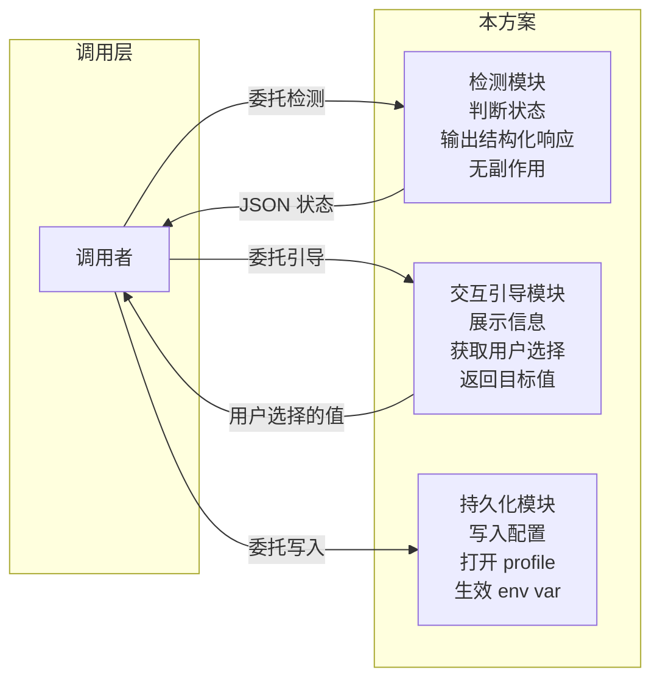
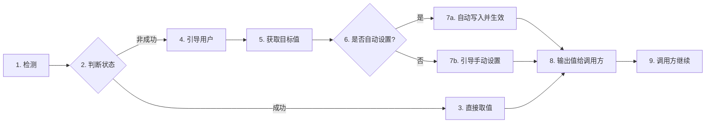
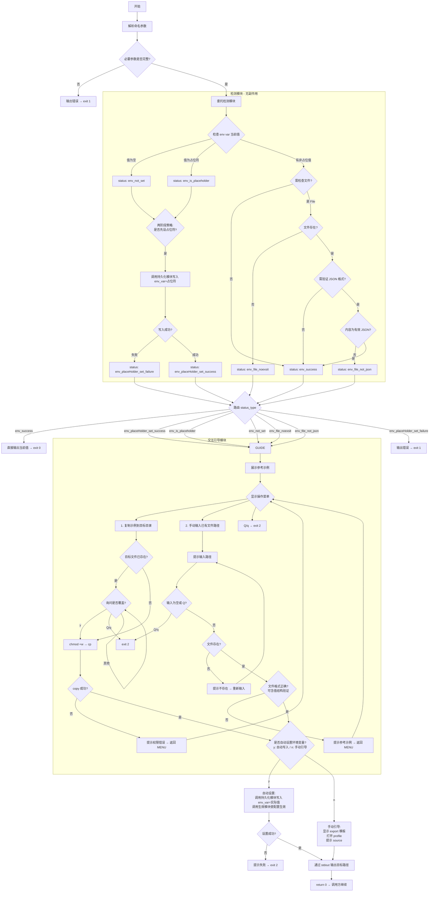

# 环境变量/配置文件缺失引导方案

当脚本缺少必要的环境变量，或环境变量指向的文件不存在/格式无效时，按以下设计总则实现引导用户补充的完整流程。

---

## 1. 问题域定义

### 1.1 什么算"缺失"

一个环境变量可能处于以下任一"非可用"状态：

| 状态 | 含义 | 检测条件 |
|------|------|---------|
| 未设置 | env var 不存在或为空 | 值为空 |
| 占位值 | env var 的值仍是占位符，未被替换 | 值 == 占位符 |
| 文件不存在 | env var 指向的路径不是有效的文件 | 值非空但文件不存在 |
| 格式无效 | 文件内容不符合预期的格式（如 JSON） | 文件存在但解析失败 |

### 1.2 解决目标

让调用方总能拿到一个可用的值，且后续不再重复引导。

---

## 2. 架构原则

### 2.1 三模块职责划分



### 2.2 关键约束

- **检测模块不应有交互副作用**：不要一边检查一边弹菜单
- **交互模块不应直接写入系统配置**：写配置是持久化模块的职责
- **每个模块应可独立测试**：给定输入，断言输出和副作用

### 2.3 通信通道约定

| 通道 | 用途 | 消费者 | 约束 |
|------|------|--------|------|
| stdout | 机器可读的结构化数据 | 调用方（捕获） | 必须是结构化格式 |
| stderr | 人类可读的交互信息 | 终端用户 | 颜色、格式随意 |
| exit code | 执行结果状态 | 调用方（判断） | 语义化枚举 |

- 检测模块的响应为 `{"status_type": "<枚举值>", "message": "<描述>"}`
- 所有交互信息必须输出到 stderr，禁止 stdout 输出来自人类的交互文本

### 2.4 两阶段占位符策略

**问题**：env var 为空时若直接打开 profile 让用户编辑，编辑期间其他程序可能读到空值。

**方案**：先写入占位符 → 再引导用户替换为实际值。

```
阶段一：env_var = your_ENV_NAME_value（占位符）
阶段二：引导用户将占位符替换为实际值
```

**好处**：中间状态可识别、避免空值竞态、调用方可阶段一后继续、无需等用户编辑。

---

## 3. 概要流程

架构原则描述了"谁做什么"，核心流程是完整的状态机。概要流程是中间的**线性主干**——忽略细节分支，只展示一次完整调用从开始到结束的必经步骤：



**步骤说明：**

| 步骤 | 职责模块 | 说明 |
|------|---------|------|
| 1. 检测 | 检测模块 | 检查 env var 状态，无副作用 |
| 2. 判断状态 | 调用方 | 根据返回的 status_type 决定下一步 |
| 3. 直接取值 | 调用方 | env_success：直接读 env var 值 |
| 4. 引导用户 | 引导模块 | 展示示例 → 显示菜单 → 获取用户选择 |
| 5. 获取目标值 | 引导模块 | 验证输入/复制结果，确保值可用 |
| 6. 是否自动设置 | 引导模块 | 询问用户：自动写入 or 手动引导 |
| 7a. 自动写入并生效 | 持久化模块 | 写入 profile + source 生效 |
| 7b. 引导手动设置 | 引导模块 | 显示 export 模板 + 打开 profile + 提示 source |
| 8. 输出值 | 引导模块 | stdout 输出目标路径 |
| 9. 调用方继续 | 调用方 | 捕获 stdout 拿到值，继续执行 |

---

## 4. 核心流程（状态机）



### 4.1 状态枚举

| status_type | 含义 | 后续动作 |
|-------------|------|---------|
| `env_success` | env var 正常可用 | 直接输出值 → exit 0 |
| `env_not_set` | env var 未设置 | 两阶段：先设占位符，再引导替换 |
| `env_is_placeholder` | env var 仍是占位值 | 引导替换为实际值 |
| `env_placeHolder_set_success` | 占位符已成功写入 | 引导替换为实际值 |
| `env_placeHolder_set_failure` | 占位符写入失败 | 输出错误 → exit 1 |
| `env_file_noexsit` | 文件不存在 | 引导修改路径 |
| `env_file_not_json` | 文件不是有效 JSON | 引导修复文件 |

### 4.2 Exit Code 约定

| Code | 含义 |
|:----:|------|
| 0 | 成功：值已就绪，stdout 包含结果 |
| 1 | 参数错误或系统失败 |
| 2 | 用户主动退出（Q/q）或操作失败 |

---

## 版本记录

- 0.0.4 (2026-05-16): 精简至核心 §1-§4，通信协议和占位符策略并入 §2/§4，删除伪代码和详细实现条款
- 0.0.3 (2026-05-16): 新增概要流程，伪代码改用 JavaScript
- 0.0.2 (2026-05-16): 重构为抽象设计总则，补全状态机、通信协议、模块接口、验收标准
- 0.0.1 (2026-05-14): 初始版本
