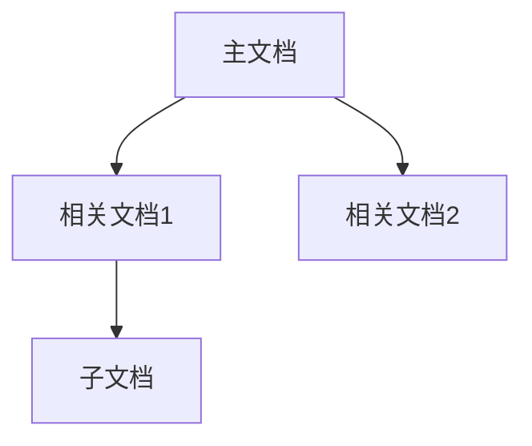
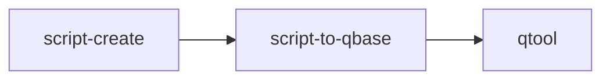

# Doc Organizer

将文档整理成知识图谱，梳理关联关系，生成索引。

## 触发条件

- "整理文档关系"
- "生成知识图谱"
- "梳理关联"
- "整理成图谱"
- "生成 skill 索引"
- "整理 README"

## 执行流程

### 1. 扫描文档

```bash
# 扫描所有 md 文件
find . -name "*.md" -type f

# 扫描 SKILL.md
find . -name "SKILL.md" -type f
```

### 2. 提取元信息

从 frontmatter 提取：
- `name`: 名称
- `description`: 描述

从文档提取：
- 链接关系 `[xxx](./xxx)`
- 引用关系 `# xxx`

### 3. 分析关联

判断文档关系类型：
- **依赖**：被其他文档引用
- **引用**：引用其他文档
- **主文档**：入口/索引
- **子文档**：详细说明

### 4. 生成 Mermaid 图



### 5. 输出索引表

| 文档 | 关联 | 类型 | 描述 |
|------|------|------|------|
| xxx  | yyy  | 依赖 | xxx  |

## Skill 整理专用

### 分类标签

| 分类 | 说明 |
|------|------|
| **创意娱乐** | 聊天回复、游戏 |
| **脚本开发** | 代码生成、发布 |
| **文档类** | 读、写、整理 |
| **架构类** | 项目结构、模板 |
| **工具类** | 测试、部署 |

### 快速索引格式

```markdown
| 分类 | 用途 | Skills |
|------|------|--------|
| 💬 聊天 | 回复 crush | [crush-reply](./crush-reply) |
| 🎮 游戏 | 猜成语 | [emoji-idiom](./emoji-idiom) |
```

### Workflow 流程



## 输出格式

1. **Mermaid 关系图** - 可视化，方便查看
2. **快速索引表** - Emoji 分类，一眼找到
3. **详细表格** - 包含描述和触发场景
4. **Workflow** - 常用流程串联

## 常用示例

### Skill 索引输出

```
| Skill | 描述 | 触发场景 |
|-------|------|----------|
| crush-reply | 生成幽默回复 | crush: xxx |
| emoji-idiom | 猜成语 | 猜成语 |
```

### 文档关系输出

```
| 文档 | 关联 | 类型 |
|------|------|------|
| README | 主文档 | 索引 |
| SKILL.md | 依赖 | 详细 |
```