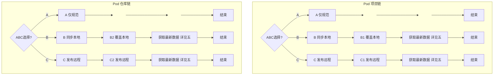

# pod-action

当用户想要查看自己的 CocoaPods Pod 列表，或查看哪些仓库发布了对应的 Pod 时触发。

## 触发条件

当用户需要整理 CocoaPods Pod 列表（获取/匹配 pod 数据）或规范化 podspec（完善注释/同步到项目列表）时触发。


## 执行流程

### 1、规范化 podspec 信息

podspec 规范化，完善 podspec 注释/格式，支持 pod 项目和 Pod 仓库两种目录模式。

#### 1.1、确认工作目录

1. 输出 `pwd` 给用户
2. 询问用户：
   - `yes` → 使用当前目录
   - 输入其他路径 → 使用输入的路径
   - `quit` → 退出

#### 1.2、判断是 `Pod项目` 还是 ` Pod仓库`

输出判断结果让用户确认：
- `yes` → 通过，进入下一步
- `no` → 让用户手动选择目录类型
- `quit` → 退出

#### 1.3、根据判断结果，运行 `podspec_normalize.sh` 进行 podspec 的规范化

运行后向用户展示 podspec 的变更内容（新增的注释、更新的 description）。

#### 1.4、选择后续操作

确认结果后：

- **否** → 结束
- **是** → 选择后续操作：



#### 1.5、流程细则

**项目链节点：**

[A: 仅规范] → 后续手动到 pods_all.json 补充/替换 → 结束

[B1: 同步本地] → 覆盖本地缓存。询问公有/私有：
- 公有 → 覆盖 trunk 缓存中对应 .podspec.json（详见三.1）
- 私有 → 覆盖本地 dvlproadSpec 项目（详见三.1）

[C1: 发布远程] → 发布到远程。询问公有/私有：
- 公有 → pod trunk push（详见三.2）
- 私有 → pod repo push dvlproadSpec（详见三.2）

**仓库链节点：**

[A: 仅规范] → 结束

[B2: 同步本地] → 覆盖本地 .podspec 文件（详见四.1）

[C2: 发布远程] → git commit + push + pod repo update（详见四.2）

### 2、获取 & 更新 Pod 数据

1. Agent 检查 `pods_all.json` 是否存在（帮用户查找已有文件或确认指定路径）
   - **存在** → 向用户提供两个选项：全量获取 / 单条更新
   - **不存在** → 告知用户无可用的数据文件，仅提供全量获取

2. 根据用户选择：
   - **全量获取** → 先确定输出路径（详见五.1），再执行 `pods_fetch_to_md.sh`（详见五.2）
   - **单条更新** → 先确定已有文件路径（详见五.1），再执行 `public-pod-complete2-pods_json.py`（详见五.3）

## 一、pod项目类型判断规则

检查目录特征：

- 根目录下有 `.podspec` → **Pod 项目**（扁平模式，后续用 `--project-dir`）

  （如 `/Users/qian/Project/Github/CJUIKit`）

- 子目录下有 `.podspec` → **Pod 仓库**（嵌套模式，后续用 `--spec-dir`）

  （如 `/Users/qian/Project/Gitee/dvlproadSpecs` )

- 其他设置为未知。


## 二、运行 `podspec_normalize.sh` 进行 podspec 的规范化

根据pod项目类型判断结果使用对应方式：

- **Pod 仓库**（嵌套模式）→ 使用 `--spec-dir`：

  ```bash
  sh normalize-podspec-option2-project_list/scripts/podspec_normalize.sh \
    --spec-dir <目录>

- **Pod 项目**（扁平模式）→ 使用 `--project-dir`：

  ```bash
  sh normalize-podspec-option2-project_list/scripts/podspec_normalize.sh \
    --project-dir <目录>

## 三、同步到 CocoaPods（单个 pod）

### 1、同步到本地 CocoaPods (pod repo)

#### 1.1、同步到本地 trunk

1. 找到 trunk 中该 pod 最高版本路径（如 ~/.cocoapods/repos/trunk/Specs/.../CJUIKit/1.4.0/CJRadio.podspec.json）

2. 展示路径，二次询问用户是否真的要进行覆盖。

3. 进行覆盖步骤：

   3.1 将本地的 `.podspec` 通过 `pod ipc spec` 转为 `.podspec.json`

   3.2 用 `.podspec.json` 内容覆盖 trunk 仓库中的 .podspec.json 文件


#### 1.2、同步到本地 dvlproadSpec

1. 找到 dvlproadSpec 中该 pod 最高版本路径

2. 展示路径，二次询问用户是否真的要进行覆盖。

3. 进行覆盖步骤：

   3.1 将本地的 `.podspec` 内容覆盖 dvlproadSpec 仓库中的 .podspec 文件

### 2、同步到远程 CocoaPods

#### 2.1、同步到远程 trunk

**trunk 公有库（发布）：**

```bash
# 确保已登录 trunk：
pod trunk me

# 发布到 CocoaPods trunk：
pod trunk push <本地.podspec> --allow-warnings

# 更新本地 trunk 缓存：
pod repo update trunk
```

#### 2.2、同步到远程 dvlproadSpec

**dvlproadSpec 私有库（发布）：**

```bash
# 推送到私有 spec repo：
pod repo push dvlproadSpec <本地.podspec> --allow-warnings

# 更新本地私有 repo 缓存：
pod repo update dvlproadSpec
```

## 四、同步到 CocoaPods（整个 Spec 仓库，极少情况，且不推荐使用）

> ⚠️ 只针对私有仓库，不对公有仓库处理。且不推荐使用。

适用场景：Pod 仓库链的 B2/C2 操作，将整个 spec 仓库同步到本地 CocoaPods 缓存和远程。

### 1、同步到本地 CocoaPods（B2 覆盖本地）

找到 CocoaPods 缓存中对应的 spec 仓库目录（如 `~/.cocoapods/repos/dvlproadSpec/`）：

1. 展示路径，二次询问用户是否真的要进行覆盖
2. 将本地整个 spec 仓库内容同步到 CocoaPods 缓存：

```bash
rsync -av <本地 spec 仓库目录>/ ~/.cocoapods/repos/dvlproadSpec/
```

### 2、同步到远程 CocoaPods（C2 发布远程）

将本地的 spec 仓库变更推送到远程：

```bash
cd <spec 仓库目录>
git add .
git commit -m "update all podspec"
git push

# 更新本地 CocoaPods 缓存
pod repo update
```

## 五、获取 & 更新 Pod 数据

### 1、pods.json 路径说明

`pods_all.json` 的路径在全量获取和单条更新中用途不同，分开处理。

#### 全量获取：确定输出路径

Agent 检查 `项目列表/dvlproad项目列表/data/` 目录是否存在：
- **存在** → 推荐给用户作为输出目录
- **不存在** → 请用户指定路径
- 用户留空 → 放当前工作目录

确认后，将候选路径作为 `--json path` / `--md path` 的参数值。

Agent 话术：
> 将输出文件放到 `xxx/` 目录下，可以吗？或者你指定其他路径？留空则放当前目录。

#### 单条更新：定位已有文件

Agent 优先在 `项目列表/dvlproad项目列表/data/` 下查找 `pods_all.json`：
- **存在** → 推荐给用户使用
- **不存在** → 请用户指定 `pods_all.json` 所在路径

确认后，将该路径传入 `public-pod-complete2-pods_json.py` 的第二个参数。

Agent 话术：
> 在 `xxx/` 目录下找到了 `pods_all.json`，使用该文件进行单条更新，可以吗？

### 2、全量获取：重新获取所有的 pods_all.json

#### 2.1、pods_fetch_to_md.sh 脚本说明

**pods_fetch_to_md.sh 可输出 pods_all.json 和 pods_all.md**

| 功能       | 说明                                                         |
| ---------- | ------------------------------------------------------------ |
| 脚本路径   | `organize-pod-to-md/scripts/pods_fetch_to_md.sh`             |
| 公有数据源 | `pod trunk me` + 本地 trunk/cocoapods repo 缓存              |
| 私有数据源 | 扫描 `gitee-dvlproad-dvlproadspecs` 的全部 `.podspec`（Ruby 格式，Python 正则解析） |
| 输出       | `--json` → JSON / `--md` → Markdown（至少指定一个）          |
| 去重规则   | 同一 pod 在公有和私有都存在 → 标记为 CocoaPods / 公有        |
| 性能       | 公有约 60 个 pod，私有约 128 个 pod，合计约 2-3 分钟         |

#### 2.2、pods_fetch_to_md.sh 脚本使用

```bash
sh organize-pod-to-md/scripts/pods_fetch_to_md.sh --repos <repo1,repo2,...> [--json path] [--md path]
```

必传参数：

- `--repos` — 逗号分隔的 CocoaPods repo 目录名（trunk/cocoapods → 公有，其他 → 私有）

至少指定一个输出参数：

- `--json path` — 输出 JSON 路径（相对于当前工作目录）
- `--md path` — 输出 Markdown 路径（相对于当前工作目录）

例如：

```bash
sh organize-pod-to-md/scripts/pods_fetch_to_md.sh --repos trunk --json pods.json                 # 输出到当前目录
sh organize-pod-to-md/scripts/pods_fetch_to_md.sh --repos trunk --json ../output/pods.json       # 相对路径
sh organize-pod-to-md/scripts/pods_fetch_to_md.sh --repos trunk --json /tmp/pods.json            # 绝对路径（目录必须存在）
sh organize-pod-to-md/scripts/pods_fetch_to_md.sh --repos trunk,dvlproad --json data.json --md pods.md  # 同时输出 JSON 和 MD
```

生成文件：

- `pods.json` — 给脚本用的结构化数据
- `pods.md` — 给人看的表格

### 3、单条更新：更新或补充某个podspec到已有的pods_all.json

#### 3.1、public-pod-complete2-pods_json.py 脚本使用

单条更新 `pods_all.json` 中某条 pod 的记录：

```bash
python3 normalize-podspec-option2-project_list/scripts/public-pod-complete2-pods_json.py \
  <本地 podspec 路径> \
  <pods_all.json路径>
```


## 注意事项

1. **podspec_normalize.sh 路径** — 位于 `normalize-podspec-option2-project_list/scripts/podspec_normalize.sh`，非本技能目录下
2. **public-pod-complete2-pods_json.py 路径** — 位于 `normalize-podspec-option2-project_list/scripts/public-pod-complete2-pods_json.py`，非本技能目录下


## 版本记录

### 0.0.4 (2026-05-22): 按 record-to-skill 规范重构
- 流程概览与展开章节分离：1.4 Mermaid 图 + 1.5 流程细则
- Mermaid 简化：去除公有/私有判断节点，用 B1/B2、C1/C2 编号区分项目链和仓库链
- 新增 `### 2、获取 & 更新 Pod 数据` 决策层：全量/单条选择 + pods_all.json 存在检查
- `## 四` 拆为四.1 路径说明 + 四.2 全量获取 + 四.3 单条更新
- 输出路径决策归入四.1，区分全量（设置）和单条（定位）两种场景
- 空节点改用 `classDef hide` 规范

### 0.0.3 (2026-05-22): 重构为两阶段流程
- 简化为两阶段：阶段一（规范化）+ 阶段二（获取 & 更新 Pod 数据）
- 合并原阶段三到阶段二，作为"更新模式"子流程
- 总览流程图简化为一条线
- 各阶段内部有独立的子流程图
- 新增阶段一 Step 0-2.5 详细流程
- 明确引用 `normalize-podspec-option2-project_list` 目录下的脚本

### 0.0.2 (2026-05-10): 新增私有 Pod 扫描、来源/可见/语言列
- `pods_fetch_to_md.sh`: 新增扫描 `dvlproadSpecs` 私有 repo 的 `.podspec` 文件
- JSON/MD 新增 `source`、`visibility`、`language` 三个字段
- Pod 情况表从 4 列扩展到 7 列
- 语言根据 `swift_version` 字段自动判断（Swift/OC）
- 公有/私有去重：优先公有

### 0.0.1 (2026-05-09): 初始版本
- `pods_fetch_to_md.sh`: 获取所有 pod 数据，输出 md + json
- `repos_md_append_pods.sh`: 将 pod 按 git URL 匹配到项目列表，在每个有 pod 的 section 后追加 Pod 情况表格，主表不改
