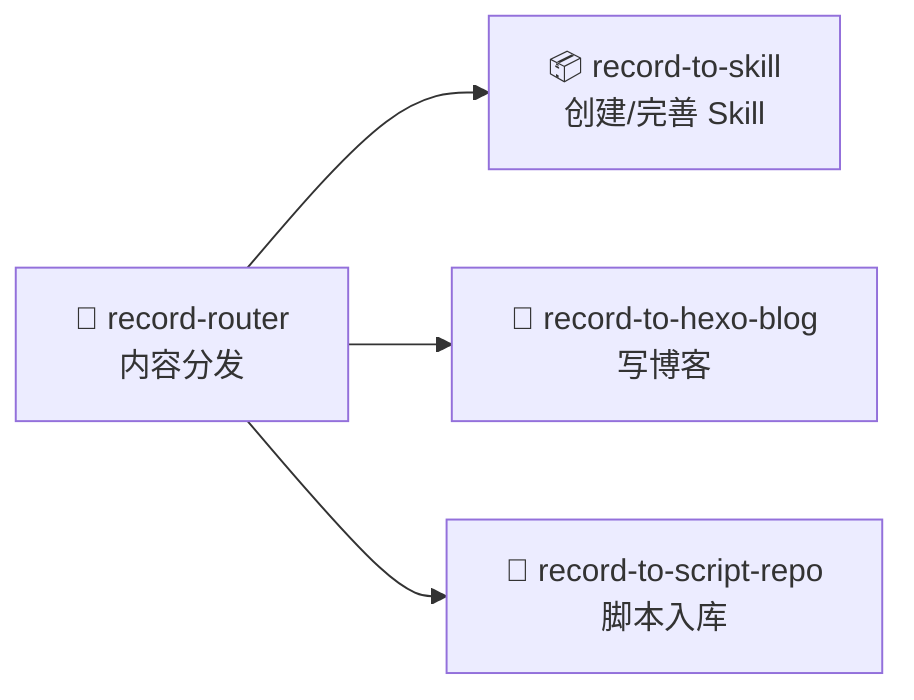

# Skill 关系整理

扫描目录下的 SKILL.md，输出**分类关系图** + **索引表**。

## 触发条件

- "整理 skill 关系"
- "生成 skill 知识图谱"
- "梳理 skill 关系"
- "生成 skill 索引"
- "整理 README"

## 执行步骤

### 1. 扫描所有 SKILL.md

```bash
find . -name "SKILL.md" -type f | sort
```

排除 `node_modules`、`.git`。

### 2. 解析前置数据

对每个 SKILL.md，提取：

from YAML frontmatter:
- `name:` — Skill 名称
- `description:` — 触发场景、用途描述

from 文件路径:
- dirname — 分类依据（一级子目录）

### 3. 检测跨 Skill 引用

搜索每个 SKILL.md 中引用其他 Skill 的情况：

```bash
# 引用其他 SKILL.md（如 ../xxx/SKILL.md）
grep -oP '\.\./\w[\w-]*(?=/SKILL\.md)' file

# 引用根目录 .md（如 ./xxx.md）
grep -oP ']\\(\./\w[\w-]*\.md\\)' file
```

一级引用（A → B）：A 的 SKILL.md 中出现 B 的路径
二级引用（A → B → C）：B 引用了 C，则 A 间接依赖 C

### 4. 分类

按目录名归类：

| 目录前缀 | 分类名 |
|----------|--------|
| `record-*` | 📝 内容记录 |
| `organize-*` | 📁 内容整理 |
| `script-*` | 📝 脚本相关 |
| `life-*` | 💬 创意娱乐 |
| `project-*` | 📋 项目列表管理 |
| `normalize-*` | 🔧 功能模块 |
| `dev-*` | 🔧 功能模块 |
| `guide-*` | 🔧 功能模块 |
| `opencode-*` | 🔧 功能模块 |
| 其余 | 按触发词匹配 |

### 5. 输出格式

#### 关系图（Mermaid）

每个分类一个子图：



连线规则：
- A SKILL.md 直接引用 B 的路径 → `A --> B`（实线，路由/调用）
- A 只用到了 B 的方案/数据 → `A -.-> B`（虚线，引用）
- 双向引用 → `A <--> B`

#### 索引表

```markdown
| Skill | 描述 | 触发场景 |
|-------|------|----------|
| [xxx](./xxx) | 一句话说明 | 关键词 |
```

### 6. 工作流示例


## 产出示例

执行后输出的内容可以直接插入 README.md 的 `## Skill 分类详解` 位置，替换旧内容。
