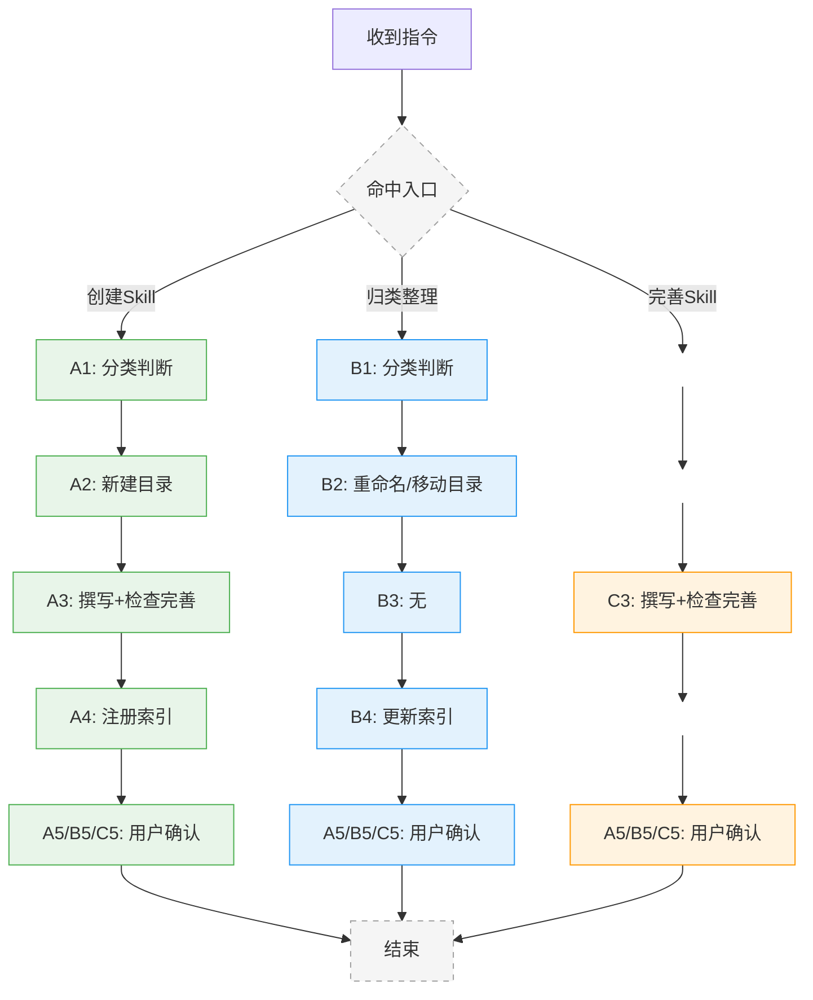

# Skill 创建、归类整理与完善指南

帮助用户创建新 Skill、归类整理已有 Skill，或按要求和规范检查完善已有 Skill。

## 触发条件

- **被 record-router 路由"创建 Skill"任务时** → 走写作流程（A）
- **被 record-router 路由"完善 Skill"任务时** → 走完善流程（C）
- **用户输入"整理技能" / "归类 skill" / "重命名技能" 等指令时** → 走归类整理流程（B）

## 引用规范

当涉及命名约定或流程对比时，优先参考以下规范：

- 分类归属规则：暂无
- 命名约定：[《命名规范.md》](../命名规范.md)
- 流程对比：[《流程对比规范.md》](../流程对比规范.md)

## 流程概览



以上流程涉及的技术点（检查项、章节规范等），见以下对应章节。

## 流程细则

[A1: 分类判断] → 判断新 Skill 的命名和位置，对照命名规范确定目录名，不确定时询问用户
[B1: 分类判断] → 判断已有 Skill 的目标命名和位置，对照命名规范确定目录名，不确定时询问用户
[A2: 新建目录] → 按命名规范创建 skill 目录
[B2: 重命名/移动目录] → 修改目录名，更新 SKILL.md 中的 name，涉及删除源目录时先向用户确认
[B3: 无] → 此步无操作（占位对齐）
[A3/C3: 撰写+检查完善] → 按模板撰写 SKILL.md 内容，同时按三~六节规范逐条落实
[A4: 注册索引] → 在 README.md 对应分类表格中新增一行，在 .opencode/INSTALL.md 的 Available Skills 中新增条目
[B4: 更新索引] → 修改 README.md 和 .opencode/INSTALL.md 中对应的条目
[A5/B5/C5: 用户确认] → 展示所有修改让用户确认，确认后再结束

## 一、相关文件位置规范

| 项目 | 规范 |
|------|------|
| SKILL.md | 必须放在 Skill 目录下 |
| 脚本存放 | 如有配套脚本，统一放 `scripts/` 子目录 |
| 资源文件 | 放 `resources/` 子目录 |

## 二、内容基本规范

### 引用规范

当涉及命名约定时，优先参考以下规范：

- 分类归属规则：暂无
- 命名约定：[《命名规范.md》](../命名规范.md)
- 流程对比：暂无

### 1. 命名规范

Skill 命名遵循[《命名规范.md`](../命名规范.md)（`<域>-<对象>-<行为>` 结构，**以域开头**）。

### 2. 创建规范

检查 skill 是否遵循官方的 `skill-create` 规范：

- 使用标准 YAML 头部（name、description）
- 包含触发条件说明
- 内容结构清晰

如不遵循，则按 `skill-create` 规范补充。

---

## 三、内容骨架规范

```yaml
---
name: skill-name
description: |
  技能描述，说明触发场景
  触发场景：
  - 用户输入"xxx"时触发
---

# 技能标题

## 触发条件

## 执行流程

## 安装步骤（如涉及文件生成）

## 使用说明

## 卸载步骤（如涉及文件修改）

## 版本记录
```

---

## 四、章节结构顺序规范

### 1. 执行流程概览与相关技术实现展开分离

**原则：**
- 执行流程保持纯步骤指导，不要混入大量示例内容
- 技术细节和示例应放到独立的详细展开章节

**检查项：**
- 检查概览（`## 执行流程`）是否使用 Mermaid 图或 `### N.` 编号列表写流程描述（优先选更能清晰呈现流程效果的方式），且未混入技术细节
- 检查技术点是否已拆到独立的 `## N、` 章节，概览通过 `（详见 §X）` 引用
- 检查概览尾是否有过渡句：`以上流程涉及的技术点，见以下对应章节。`
- **注意**：`## N、` 是与流程步骤非一一对应的技术知识章节；一个步骤可引用多个章节，多个步骤也可引用同一章节

参考示例：[organize-repos-to-md/SKILL.md](../organize-repos-to-md/SKILL.md) 的"执行流程"概览与"一~四"展开章节

### 2. 文档结构/文档模板（如果有）

检查 skill 中的文档结构或文档模板是否遵循以下格式要求：

**文档模板格式：**

- 该章节下的模板内容不使用 ` ```markdown ` 包裹，直接显示
- 该章节模板里的子章节（如代码块 ` ``` `）正常渲染，不受外层影响
- 模板的标题层级 = skill 正文的标题层级 + 1（如 skill 正文用 `##`，模板用 `###`）

**示例：**

````
## 文档模板

### 一、概述
简要说明...

### 二、目录结构
```
结构内容
```

### 三、xxx
...
````

**使用案例：**

三个文件的关系（按生成顺序）：

```
record-to-skill/SKILL.md
    │
    ├── 生成《写代码结构的文档 skill.md》
    ▼
code-structure-organizer/SKILL.md
    │
    ├── 生成《代码结构的文档.md》
    ▼
script-qbase/branch.md
```

- [code-structure-organizer/SKILL.md](../code-structure-organizer/SKILL.md)

- [script-qbase/branch.md](https://github.com/dvlpCI/script-qbase/blob/main/branch.md)

### 3. 过渡语

如果skill支持用在 DeepSeek 网页版 等，应在 skill 的**末尾（版本记录前）**中添加如下过渡语内容：

------

> **引用规范**：SKILL.md 中引用 AI-qskills 内的其他项目必须使用 GitHub 链接，格式：[AI-qskills 中的 xxx](https://github.com/dvlproad/AI-qskills/blob/main/xxx/SKILL.md)，禁止使用本地绝对路径。
>
> **博客引用**：如有对应的博客文章，在 SKILL.md 末尾（版本记录前）添加引用。格式：[仓库名的《博客标题》](博客HTTP地址)，如 [dvlproadHexo的《AI-③opencode会话管理》](https://dvlproad.github.io/AI/AI-③opencode会话管理/)。
>
> **注意**：以下过渡语仅适用于非 skill 环境（如直接复制给 DeepSeek 等使用）。在 OpenCode 等 skill 环境中，此段落不生效。
>
> **过渡语**：以后我输入 "营商环境主题: xxx" 的格式，你就直接生成回复。明白请回复"明白"

### 4. 一些文献

> ## 一些文献
>
> ### 初次实践的示例文件
>
> 参考 [dvlpCI/script-qbase  中 package 里的 package_remote_version.sh](https://github.com/dvlpCI/script-qbase/blob/main/package/package_remote_version.sh)

### 5. 版本记录

检查 skill 是否包含版本记录，且放在文件末尾。

**规则：**

- 新版本放在前面
- 版本更新点，如果只有一点，则更新内容可写版本后；如果有多点，则要分多行。

**格式及示例：**

```markdown
## 版本记录

### 0.0.2 (2026-04-11)

- 新增 [script-create](./script-create) skill：帮助用户创建符合统一要求的脚本
- 新增 [script-to-qbase](./script-to-qbase) skill：将独立脚本整合到 qbase 库中

### 0.0.1 (2026-04-11): 初始版本
```

---

## 五、其他规范

### 1. 代码规范

检查 skill 中的代码是否符合最佳实践。

---

## 六、场景规范

检查 skill 中某个环境是否需要支持以下场景（如涉及文件生成则需要）：

**环境判断规则**：

- 如果当前环境可以直接生成 .docx 等本地文件（如 OpenCode）→
- 如果当前环境只能输出文案（如 DeepSeek 网页版、Cursor 等）→

### 1. 文件保存目录

如果 skill 有保存文件（如生成 .docx、.xlsx 等）的情况，应在 skill 中说明：

**文件保存目录** - **必须询问**用户希望将生成的文件保存在哪个目录

> **重要**：
>
> 1. **目录询问规则**：
>    - 如果当前环境可以直接生成 .docx 等本地文件（如 OpenCode）→ **必须询问**文件保存目录
>    - 如果当前环境只能输出文案（如 DeepSeek 网页版、Cursor 等）→ **不需要询问**，直接输出文案内容
> 2. **目录确定时机**：在生成**第一个文件**（可能是方案、也可能是生成方案用的辅助脚本如 .js 文件）之前询问目录
> 3. **后续复用**：目录确认后，方案、事项清单、问卷、反馈整理、反馈报告、以及生成这些文件用的辅助脚本（如 js 文件）**都必须保存在同一目录**，无需再次询问。
> 4. **目录变量**：将确认的目录保存为变量（如 `$output_dir$`），后续所有文件路径都使用该变量。

### 2. 文件检查和更新

如果 skill 需要检查和更新文件，应在 skill 中将文件检查和更新逻辑用 Mermaid graph 流程图表示出来。

**逻辑描述（通用）**：

- AI 检查文件是否存在，如不存在则提示用户
- AI 检查文件中是否已有所需的配置（如新增字段、修改配置等）
- 如需要更新，进行修改后展示给用户确认
- 用户确认后进行下一步

**参考示例**：要判断 qbase.json 中的字段的添加和修改（详见 [《script-to-qbase/SKILL.md》中的【在 qbase.json 中添加/更新配置（如需要）】](../script-to-qbase/SKILL.md)

**参考逻辑（具体示例）**：

- 如果前一步选择的是新增：则应该你帮我判断qbase.json里有新增了没。没有则进行新增，并在新增后让我确认，然后在我确认后进行下一步；
- 如果前一步选择的是修复：则应该你帮我判断qbase.json是否需要修改。需要则进行修改，并在修改后让我确认，然后在我确认后进行下一步。如果不需要修改，则进行下一步）

### 3. 让用户选择要提交的文件

如果 skill 涉及 git 提交（如发布新版本），应在 skill 中说明文件选择和确认流程。

**逻辑描述**：

- AI 先分析修改内容，将所有修改的文件分为两部分：
  - **第一部分（建议提交）**：根据修改内容分析应该提交的文件
  - **第二部分（其他）**：其他修改的文件
- 请用户确认：
  - 输入 `yes`：确认建议无误，继续执行
  - 输入 `no`：分析有误，让用户选择所有要提交的文件编号（多个用空格分隔，即使之前建议里的某个正确也要重新选）
- 选择后再让用户确认，直到用户确认

**参考示例**：详见 [《script-to-qbase/SKILL.md》中的【让用户选择要提交的文件】](../script-to-qbase/SKILL.md)

## 版本记录

- 0.0.6 (2026-05-19): 重构为 A 写作 / B 归类整理 / C 完善三流程，增加流程概览图
- 0.0.5 (2026-05-18): 重构为创建/完善双流程，检查项拆为独立章节（三~六）
- 0.0.4 (2026-05-18): 新增"创建新技能"流程；重构章节标题层级
- 0.0.3 (2026-04-15): 新增执行流程和文档结构检查规范
- 0.0.2 (2026-04-14): 新增让用户选择要提交的文件场景
- 0.0.1 (2026-04-13): 初始版本
