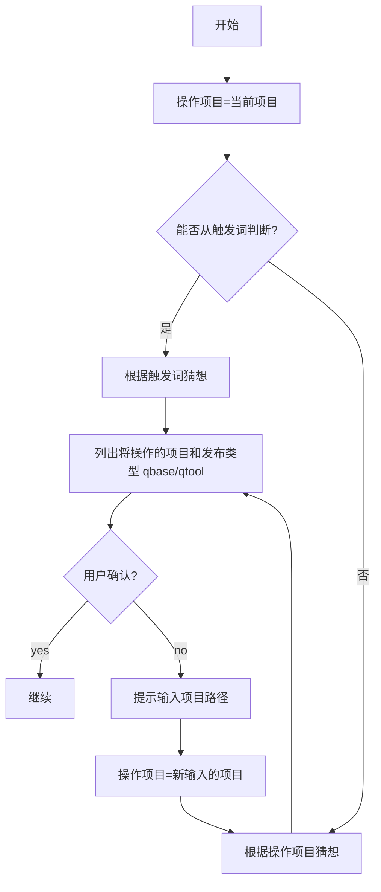
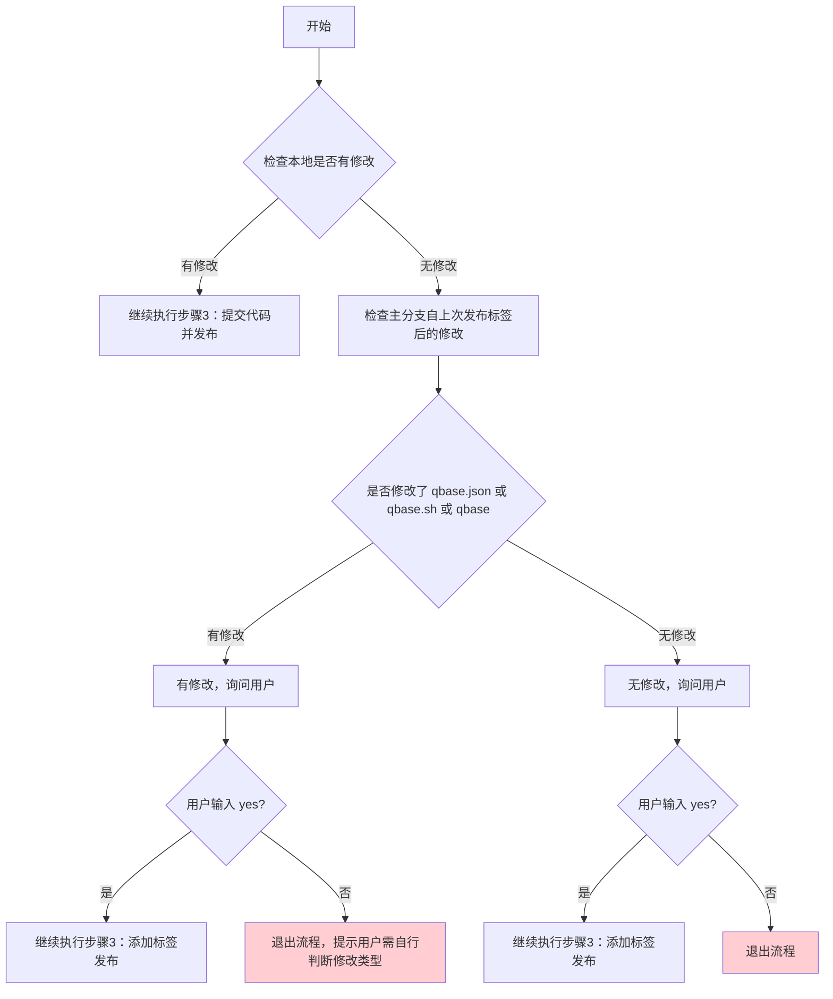
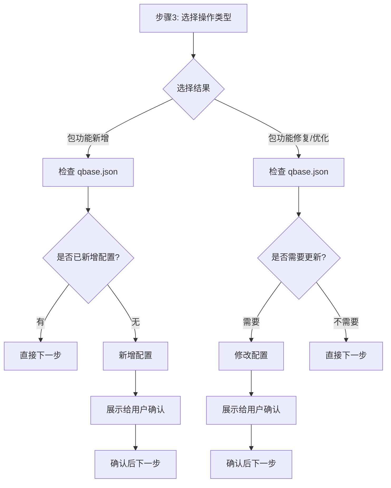
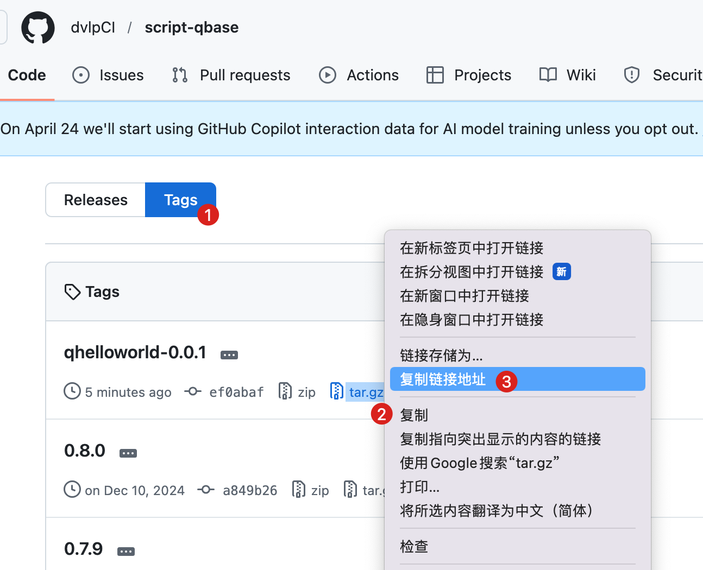

## qtool 适配说明（重要）

本 Skill 以 `qbase` 为示例。若目标为发布 `qtool` 新版本，整体流程基本不变；请将文中 `qbase` 相关标识按下表替换为 `qtool` 对应标识。若与 `qtool` 实际仓库结构或命名不一致，以实际为准。

### 必须替换/确认清单

script-项目

| 替换项描述       | qbase                                   | qtool                                   | 其他                                                         |
| ---------------- | --------------------------------------- | --------------------------------------- | ------------------------------------------------------------ |
| 脚本仓库名       | `script-qbase`                          | `script-branch-json-file`               | 同步替换所有 GitHub URL 中的仓库路径                         |
| 可执行与脚本文件 | `qbase`、`qbase.sh`、`qbase重新生成.sh` | `qtool`、`qtool.sh`、`qtool重新生成.sh` | 若 `qtool` 没有同名重编译脚本，以实际构建命令为准            |
| 配置文件名       | `qbase.json`                            | `qtool.json`                            | 同步调整文中所有引用处                                       |
| 版本标签与产物   | `script-qbase` 的 tag 与 `.tar.gz`      | `script-qtool` 的 tag 与 `.tar.gz`      | `curl` 下载链接和 `sha256` 计算命令中的包名需一致            |
| 文档链接         | qbase 相关文档链接                      | qtool 对应文档链接                      | 若暂无 qtool 文档，可先保留说明并补充 TODO                   |
| 更新命令         | `qbase check-version`                   | `qbase check-version`                   | `qbase check-version`                                        |
| 命令示例         | `qbase -quick ...`、`qbase --version`   | `qtool -quick ...`、`qtool --version`   | `brew upgrade qbase` 也需替换为 `brew upgrade qtool`（按实际包名） |

homebrew-项目

| 替换项描述 | qbase | qtool | 其他 |
| --- | --- | --- | --- |
| Homebrew tap 仓库名 | `homebrew-qbase` | `homebrew-tools` | 与组织名、远程地址保持一致 |
| Formula 文件与类名 | `qbase.rb` / `Qbase` | `qtool.rb` / `Qtool` | 文件名与类名需符合 Homebrew 命名规范 |

满足以上替换后，后续发布步骤可按原流程执行。

# 发布homebrew

帮助用户将独立脚本整合到 qbase 库中，统一调用方式。


## 触发条件

用户输入"将脚本整合/添加到qbase" 或 "发布qbase新版本"时触发


## 核心目标

将所有脚本调用方式统一为：
```bash
qbase -quick 脚本关键字 [具名参数/参数...]
```

而不是：
- `sh xxx.sh 具名参数/参数`
- `sh ${path}/qbase.sh -quick 脚本关键字 具名参数/参数`

## 好处

### 1. 关键字（key）的好处
- **与文件名解耦**：脚本关键字是 `qbase.json` 中的 `key`，与脚本文件名无关。**即使脚本文件名变更，只要 `key` 不变，调用就不受影响**
- **统一调用方式**：从 `sh xxx.sh` 改为 `sh ${path}/qbase.sh -quick 脚本关键字`，规范化管理

### 2. qbase 加密二进制文件统一调用的好处
- **初步统一入口**：所有脚本都通过 `${path}/qbase`调用，便于管理和维护
- **初简化调用**：从 `sh ${path}/qbase.sh -quick 脚本关键字` 简化为 `${path}/qbase -quick 脚本关键字`

### 3. qbase Homebrew 包的好处
- **最终统一入口**：所有脚本都通过 `qbase`调用，便于管理和维护
- **极简化调用**：从 `${path}/qbase -quick 脚本关键字` 简化为 `qbase -quick 脚本关键字`


## 整合步骤

### 步骤0：确认发布项目



**执行逻辑：**

1. **初始赋值**：操作项目 = 当前项目

2. **根据触发词判断**：
   - 若触发词是"发布qbase新版本"，则猜想发布项目是 `qbase`
   - 若触发词是"发布qtool新版本"，则猜想发布项目是 `qtool`

2. **如果无法从触发词判断**，则根据当前所在的项目路径猜想

3. **列出将操作的项目路径和猜想要发布的是qbase还是qtool**，让用户确认，直到用户输入 `yes` 才进行下一步。提示如果不是，请输入你想发布的项目的路径。

4. **项目名确认后，继续后续发布步骤**：
   - 如果确认结果不是 `qbase` 或 `qtool`，则提示：`不支持发布 qbase 和 qtool 之外的包，流程结束。`
### 步骤1：检查本地修改状态



**执行逻辑：**

1. **检查本地是否有修改：**
   ```bash
   git status --porcelain
   ```

2. **如果有修改** → 直接继续执行步骤3：提交代码并发布

3. **如果没有修改** → 检查主分支自上次发布标签后的修改：
   ```bash
   # 获取最近发布的标签
   git tag --sort=-v:refname | head -1
   
   # 检查自上次标签后的修改
   git log {上次标签}..HEAD --oneline -- qbase.json qbase.sh qbase
   ```

4. **检查结果处理：**
   - **有修改** → 提示"有修改"，用户输入 `yes` 继续添加标签发布，输入其他则退出
   - **无修改** → 提示"无修改"，用户输入 `yes` 继续添加标签发布（可能只是打标签），输入其他则退出

**提示用户：**
```
检查结果：{有/无}修改
请确认是否继续添加标签发布？（输入 yes 或其他退出）
```

### 步骤2：检查当前分支（重要！）

**必须在主分支上进行发布操作！**

```bash
# 检查当前分支
git branch --show-current

# 如果不在主分支，切换到主分支
git checkout main

# 拉取主分支最新代码
git pull origin main
```

| 检查项 | 要求 |
|--------|------|
| 当前分支 | 必须是 `main` 或 `master` |
| 远程状态 | 已拉取最新代码 |

如果不在主分支，需先处理后再继续。

### 步骤3：选择操作类型

请选择你此次发布的背景（输入数字）：

- 1【包功能新增】：①新增的脚本文件、② qbase.json 、③ qbase
- 2【包功能修复/优化】：①修改的脚本文件、② qbase.json(如果修改了)、③ qbase(如果重新编译了)
- 3【直接打标签发布】：我已将要修改或编译的确认无误后推送到远程了。

用户选择后，继续后续步骤。

如果选择的是"3【直接打标签发布】"，则跳到”步骤7：打标签并获取准备信息“

### 步骤4：在 qbase.json 中添加/更新配置（如需要）



**配置方法**

在 `support_script_path` 数组中添加或更新：

```json
{
    "type": "package",  // 选择合适的类型
    "des": "脚本分类描述",
    "values": [
        {
            "key": "脚本关键字",
            "des": "脚本功能描述",
            "rel_path": "./package/xxx.sh",
            "example": "qbase -quick 脚本关键字 -参数 值"
        }
    ]
}
```

**效果**：添加后即可以通过 `sh ${path}/qbase.sh -quick 脚本关键字 [具名参数/参数...]` 调用脚本。

示例：将 `package_remote_version.sh` 整合到 qbase

> **qbase.json 添加配置**：
>
> ```json
> {
>     "key": "package_remote_version",
>     "des": "检查/更新 Homebrew 包的远程版本",
>     "rel_path": "./package/package_remote_version.sh",
>     "example": "qbase -quick package_remote_version -p qbase -v -l ./check.log"
> }
> ```

### 步骤5：重新编译 qbase（如需要）

只有当 **qbase.sh 被修改** 时才需要运行 `${path}/qbase重新生成.sh`（使用 shc 将 shell 脚本转换为二进制文件）。

**编译的目的**：编译后即可通过 `${path}/qbase -quick 脚本关键字 [具名参数/参数...]` 调用脚本。

**注意**：此步骤需要 AI 执行，AI 会运行：
```bash
cd ${path} && sh qbase重新生成.sh
```

### 步骤6：提交代码并发布

此步骤由 AI 执行：

**1. 查看修改的文件**：

```bash
git status
```

**2. 提示用户确认提交内容**：

根据操作类型提示：
- **包功能新增**：选择时
  1. 请确认**新增**的脚本文件是否已提交，如果没有请添加
  2. 请确认 `qbase.json` 和 `qbase` 二进制是否已提交，如果没有请添加
- **包功能修复/优化**：选择时
  1. 请确认**修改**的脚本文件是否已提交，如果没有请添加
  2. 如果修改了 `qbase.json`，请确认该文件是否已提交，如果没有请添加
  3. 如果重新编译了 `qbase`，请确认该文件是否已提交，如果没有请添加

**3. 让用户选择要提交的文件**：

AI 先分析修改内容，将所有修改的文件分为两部分：
- **第一部分（建议提交）**：根据修改内容分析应该提交的文件
- **第二部分（其他）**：其他修改的文件

然后请用户确认：

- 输入 `yes`：确认建议无误，继续执行
- 输入 `no`：分析有误，让用户选择所有要提交的文件编号（多个用空格分隔，即使之前建议里的某个正确也要重新选）

选择后再让用户确认是否正确，直到用户确认。

示例：
```
分析修改内容，建议如下：
【建议提交】
1. qbase.sh
2. qbase.json
3. qbase
【其他修改】
4. README.md

请确认建议是否正确？（输入 yes 或 no）: 
```

如果用户输入 no：
```
请从头选择要提交的所有文件编号（多个用空格分隔）: 
```

用户选择后再确认，直到输入 yes。

**4. 执行提交并推送**：

commit message 标签根据实际情况选择：
- **【Feature】** - 新增功能/脚本
- **【Fix】** - 修复问题/bug
- **【Optimize】** - 优化/改进
- **【Update】** - 版本更新/依赖升级

```bash
git add 用户选择的文件
git commit -m "【操作类型】提交描述"

git push
```

### 步骤7：打标签并获取准备信息

**1. 创建版本标签并推送到远程**：

**注意**：版本号需由用户输入，不能自己指定。

在上一次的版本号上，给出推荐的版本号。如果是新增，末位是偶数；其他，末位是奇数。

用户输入yes，表示使用建议的版本号。否则需要用户自己输入符合要求的版本号。

```bash
# 创建标签（版本号由用户提供）
git tag -a {版本号} -m "版本 {版本号}"

# 推送标签
git push origin {版本号}
```

**2. 准备 rb 更新所需信息（tar.gz 的 url 和 sha256）**：

```bash
# 下载 tar.gz 并计算 sha256
curl -sL https://github.com/dvlpCI/script-qbase/archive/{tag}.tar.gz -o /tmp/script-qbase-{tag}.tar.gz
shasum -a 256 /tmp/script-qbase-{tag}.tar.gz
```

**3. 更新 homebrew 仓库**：

- 更新 qbase.rb 中的 version 和 sha256
- 将更新的 qbase.rb 提交并推送

### 步骤7：验证发布包（可选）

询问用户是否立即验证新版本：

- 输入 `yes`：下载并验证新版本
- 输入 `myself`：输出自行下载新包的命令
- 输入其他：跳过

如果用户输入 `yes`，在执行验证命令前询问是否需要使用代理：

```
是否需要使用代理？（输入代理命令，如 `export https_proxy=...`，不需要则直接回车）：
```

**验证步骤：**

```bash
# 步骤1. 刷新 Tap 索引（检测新版本）
# 方法二：只刷新 qbase tap（更快）
cd "$(brew --repository)/Library/Taps/dvlpci/homebrew-qbase" && git pull

# 步骤2. 升级 qbase
brew upgrade qbase

# 步骤3. 验证 qbase
qbase --version
```

验证结果：

- 验证成功：提示"新版本已发布并验证成功"，并继续下一步
- 验证失败：提示"发布成功，验证失败，请检查"

自行下载新包的命令：

```bash
# 步骤1. 刷新 Tap 索引（检测新版本）
# 方法一：刷新所有 tap
brew update
# 方法二：只刷新 qbase tap（更快）
cd "$(brew --repository)/Library/Taps/dvlpci/homebrew-qbase" && git pull

# 步骤2. 升级 qbase
brew upgrade qbase

# 附：如果你之前已经安装过qbase 0.9.0 之后的版本，则步骤1和步骤2，可简化为如下命令
qbase check-version
```

《安装和更新命令的**更多介绍》**见：[https://dvlproad.github.io/代码管理/库管理/homebrew](https://dvlproad.github.io/%E4%BB%A3%E7%A0%81%E7%AE%A1%E7%90%86/%E5%BA%93%E7%AE%A1%E7%90%86/homebrew) 中 【安装和更新命令的**更多介绍】**

### 步骤8：验证发布的脚本（如需要）

#### 9.1. 测试脚本基本命令：

```
qbase -quick 脚本关键字 --help
```

#### 9.2. 询问是否执行脚本命令：

```bash
qbase -quick 脚本关键字 [具名参数/参数...]
```

示例：

> ```bash
> qbase -quick package_remote_version -p qbase -v
> ```
>


## 附录

<a name="以 qhelloworld 为例的完整 Homebrew Tap 创建流程"></a>

## 附录一、以 qhelloworld 为例的完整 Homebrew Tap 创建流程

### 1. 脚本仓库(script-qbase)

1.1. 创建脚本仓库（如 `https://github.com/dvlpCI/script-qbase.git`）

1.2. 在仓库中添加脚本文件（如 `qhelloworld.sh`），编写脚本代码

1.3. 编译为加密的二进制文件：

   ```bash
shc -r -f ${path}/qhelloworld.sh
   ```

   - 将生成的二进制可执行文件 `qhelloworld.sh.x` 重命名为 `qhelloworld`(以便后续能够使用qhelloworld，而不是还要输qhelloworld.sh或者qhelloworld.sh.x)"

[https://dvlproad.github.io/Script/Shell/Shell高级加密可执行](https://dvlproad.github.io/Script/Shell/Shell%E9%AB%98%E7%BA%A7%E5%8A%A0%E5%AF%86%E5%8F%AF%E6%89%A7%E8%A1%8C/)

1.4. 提交代码并打标签tag到远程（如 `qhelloworld-0.0.1`），发布后 GitHub 会自动生成 tar.gz 包

1.5. 获取刚才打的tag的 tar.gz 的 url 地址，并下载。

 tar.gz 链接：如刚才打的tag是 `qhelloworld-0.0.1`，则链接为（**推荐**）

https://github.com/dvlpCI/script-qbase/archive/qhelloworld-0.0.1.tar.gz 

你可以直接在浏览器里输入后按回车来下载该文件"

你也可以通过一下方式，获取到链接为（不推荐）：

https://github.com/dvlpCI/script-qbase/archive/refs/tags/qhelloworld-0.0.1.tar.gz



1.6. 计算该包的 sha256：

   ```bash
shasum -a 256 ${path}/script-qbase-qhelloworld-0.0.1.tar.gz
   ```

### 2. Homebrew 仓库(homebrew-qbase)

2.1. 创建 homebrew tap 仓库，用于存放各种 `.rb` 文件，仓库必须已 `homebrew-` 开头，后缀名一般用你最后想要被使用比较好。

不过这里 qhelloworld 只是我们测试的一个例子，所以就不特意为其创建 tap 仓库，就暂时放在 qbase 的 tap 仓库里就好。即： `https://github.com/dvlpCI/homebrew-qbase.git`

2.2. 在上述创建的git下添加 `qhelloword.rb` 文件，配置刚才的 `url` 及通过该url对应的的.tar.gz的 `sha256`：

   ```ruby
class Qhelloworld < Formula
  url "https://github.com/dvlpCI/script-qbase/archive/qhelloworld-0.0.1.tar.gz"
  sha256 "xxxxxx"
  ...
end
   ```

**Homebrew 对 rb 文件的要求**：

- 文件名: qbase.rb （小写）

- 类名: Qbase （首字母大写，但第二个字母小写）

2.3. 提交 rb 文件

### 3. 安装、更新和使用

#### 3.1、安装、更新

见：[https://dvlproad.github.io/代码管理/库管理/homebrew](https://dvlproad.github.io/%E4%BB%A3%E7%A0%81%E7%AE%A1%E7%90%86/%E5%BA%93%E7%AE%A1%E7%90%86/homebrew) 中 【安装和更新命令的**更多介绍】**里的 【homebrew-xxx 下多 .rb 包的安装和更新】  

#### 3.2、使用

在终端输入 `qhelloworld` 即可。


## 版本记录

- 0.0.7 (2026-04-19): 适配 qtool 的发布
- 0.0.6 (2026-04-16): 调整步骤顺序（检查本地修改状态移到最前），新增检查当前分支、代理命令输入等优化
- 0.0.5 (2026-04-13): 完善整合步骤
- 0.0.4 (2026-04-13): 修复AI执行skill中断问题，让AI可以按skill自动执行完整个流程
- 0.0.1 (2026-04-11): 初始版本

## End