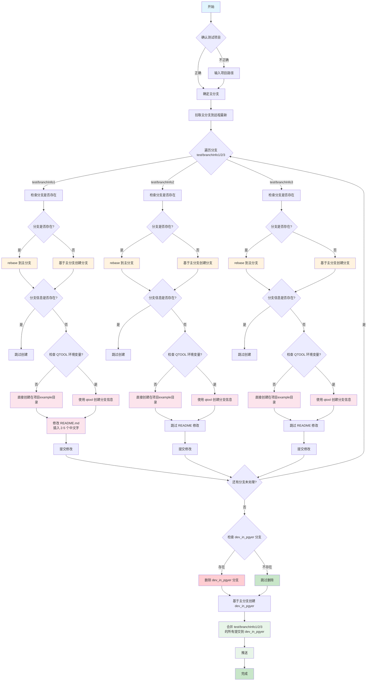

# 测试分支信息的获取

用于测试分支信息获取功能，需要创建测试分支并验证获取逻辑。

## 执行流程



## 分支信息 JSON 结构

直接创建时，在项目根目录 `example` 目录下创建分支信息 JSON 文件，结构要完整。

### 5.1 分支 JSON 结构

```json
{
  "name": "feature/user_login",
  "type": "feature",
  "create_time": "2024.03.01",
  "submit_test_time": "2024.03.10",
  "pass_test_time": "2024.03.15",
  "merger_pre_time": "2024.03.18",
  "tester": {
    "name": "zhangsan"
  },
  "answer": {
    "name": "lisi"
  },
  "outlines": [
    {
      "title": "登录模块开发",
      "weekSpend": [16, 24, 16, 8]
    }
  ]
}
```

### 5.2 字段说明

| 字段                   | 类型   | 必填         | 说明                                |
| ---------------------- | ------ | ------------ | ----------------------------------- |
| `name`                 | string | 是           | 分支名                              |
| `type`                 | string | 是           | 类型：hotfix/feature/optimize/other |
| `create_time`          | string | 是           | 创建时间（格式：YYYY.MM.DD）        |
| `submit_test_time`     | string | 测试阶段必填 | 提测时间                            |
| `pass_test_time`       | string | 预生产前必填 | 测试通过时间                        |
| `merger_pre_time`      | string | 发布前必填   | 合入预生产时间                      |
| `tester`               | object | 提测时必填   | 测试人员信息                        |
| `tester.name`          | string | 是           | 测试人员姓名                        |
| `answer`               | object | 否           | 答疑者信息                          |
| `outlines`             | array  | 否           | 工作事项列表                        |
| `outlines[].title`     | string | 是           | 事项标题                            |
| `outlines[].weekSpend` | array  | 周报必填     | 各周耗时（小时）                    |

## 示例对话

```
用户：测试分支信息的获取
助手：确认一下，您是在 /Users/lichaoqian/Project/AI/AI-qskills 项目下测试吗？
用户：不是，我在 CQCI 项目下测试
助手：请输入要测试的项目路径
用户：/Users/lichaoqian/Project/CQCI/script-qbase
助手：好的，现在开始创建测试分支...
（执行创建流程）
完成！已创建 test/branchInfo1、test/branchInfo2、test/branchInfo3 三个分支，并合并到 dev_in_pgyer 分支，可用于测试分支信息获取功能。
```
