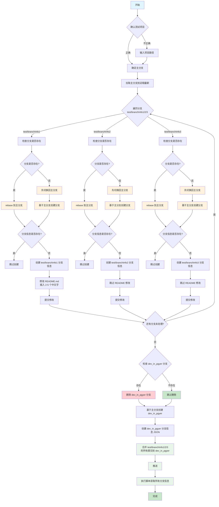
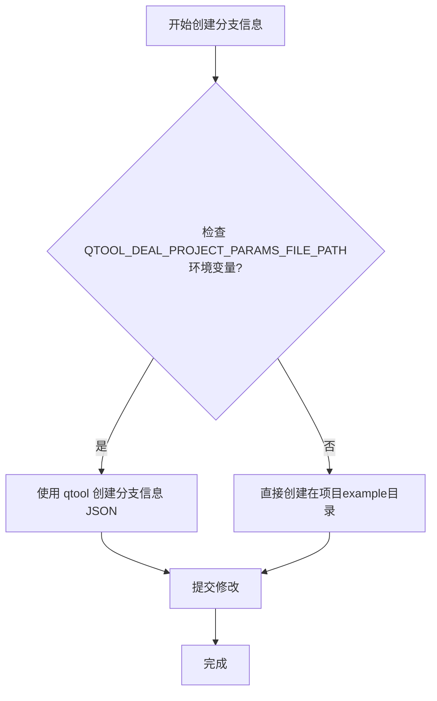

# 测试分支信息的获取

用于测试分支信息获取功能，需要创建测试分支并验证获取逻辑。

## 执行流程



## 规则

> **重要**：确保每一步执行成功（检查结果正确），才能进行下一步！

### 1. 创建分支信息

> **注意**：流程图中的"创建分支信息"步骤，按 **1.1 流程图** 处理。

#### 1.1 流程图

下文说的环境变量均为：`QTOOL_DEAL_PROJECT_PARAMS_FILE_PATH`



#### 1.2 创建位置

- **直接创建**时，在项目指定目录下创建分支信息的 JSON 文件。
  
  位置如下：
  
  - 如果是 `script-branch-json-file`项目：则创建位置在项目的`branch_quickcmd/example/featureBrances/` 目录下
  - 其他：一律在项目根目录的 `example/featureBrances/` 目录下
  
- **使用 qtool 创建分支信息**，是通过 qtool 命令创建分支信息 JSON 文件，得到的也是一个JSON文件

  ```bash
  qtool -quick branchJsonFile_create -tool_params_file_path "${环境变量指向的json文件}"
  ```
  
- **存放创建分支的目录**（最后 [执行脚本获取所有分支信息](#执行脚本获取所有分支信息) 的时候需要使用） = 生成的JSON文件的所在目录

### 2. 分支文件名

- 分支信息 JSON 文件，文件命名为 `{分支名}.json`，结构要完整。如 `test/branchInfo1`分支得到的是 `test_branchInfo1.json`

### 3. 分支 JSON 结构

#### 3.1 JSON 结构

```json
{
  "name": "feature/user_login",
  "type": "feature",
  "create_time": "2024.03.01",
  "submit_test_time": "2024.03.10",
  "pass_test_time": "2024.03.15",
  "merger_pre_time": "2024.03.18",
  "tester": {
    "name": "zhangsan"
  },
  "answer": {
    "name": "lisi"
  },
  "outlines": [
    {
      "title": "登录模块开发",
      "weekSpend": [16, 24, 16, 8]
    }
  ]
}
```

#### 3.2 JSON字段说明

| 字段                   | 类型   | 必填         | 说明                                |
| ---------------------- | ------ | ------------ | ----------------------------------- |
| `name`                 | string | 是           | 分支名                              |
| `type`                 | string | 是           | 类型：hotfix/feature/optimize/other |
| `create_time`          | string | 是           | 创建时间（格式：YYYY.MM.DD）        |
| `submit_test_time`     | string | 测试阶段必填 | 提测时间                            |
| `pass_test_time`       | string | 预生产前必填 | 测试通过时间                        |
| `merger_pre_time`      | string | 发布前必填   | 合入预生产时间                      |
| `tester`               | object | 提测时必填   | 测试人员信息                        |
| `tester.name`          | string | 是           | 测试人员姓名                        |
| `answer`               | object | 否           | 答疑者信息                          |
| `outlines`             | array  | 否           | 工作事项列表                        |
| `outlines[].title`     | string | 是           | 事项标题                            |
| `outlines[].weekSpend` | array  | 周报必填     | 各周耗时（小时）                    |

### 4、分支合并

#### 4.1 合并命令

必须使用 **octopus merge** 一次性合并多个分支：

```bash
git merge branch1 branch2 branch3 --no-edit
```

#### 4.2 为什么要用 octopus merge

- 能清晰看到合并线（`*---.   Merge branches ...`）
- 避免链式合并导致合并线不清晰

#### 4.3 错误示例

```bash
# ❌ 错误：链式合并，合并线不清晰
git merge branch1
git merge branch2
git merge branch3
```

#### 4.4 正确示例

```bash
# ✅ 正确：一次性合并三个分支
git merge test/branchInfo1 test/branchInfo2 test/branchInfo3 --no-edit
```

合并后的提交会有多个父节点（4个），确保合并线清晰可见。

<a id="执行脚本获取所有分支信息"></a>

### 5. 执行脚本获取所有分支信息

执行脚本，进行分支信息的获取，将结果存放在指定json中的指定值

**执行的脚本**：`qtool -path getBranchMapsAccordingToRebaseBranch`

**存放结果的json**： 存放创建分支的目录/app_branch_info.json

**存放结果的key**： online_branches

```bash
sh ${执行的脚本} -rebaseBranch ${主分支名} --add-value 1 -branchMapsFromDir ${存放创建分支的目录} -branchMapsAddToJsonF ${存放结果的json} -branchMapsAddToKey ${存放结果的key} -verbose
```

示例：

```bash
sh ~/Project/CQCI/script-branch-json-file/qtool.sh -quick getBranchMapsAccordingToRebaseBranch -rebaseBranch main --add-value 1 -branchMapsFromDir /Users/lichaoqian/Project/CQCI/script-branch-json-file/branch_quickcmd/example/featureBrances -branchMapsAddToJsonF /Users/lichaoqian/Project/CQCI/script-branch-json-file/branch_quickcmd/example/app_branch_info.json -branchMapsAddToKey feature_brances -verbose
```

### 6. 整理出分支信息字符串

1、整理出分支信息字符串

```bash
qbase -quick getBranchMapsInfoAndNotifiction -branchMapsInJsonF ${存放结果的json} -branchMapsInKey ${存放结果的key} -showCategoryName true -showFlag true -showName true -showTime none -showAt true -shouldMD true -robot https://qyapi.weixin.qq.com/cgi-bin/webhook/send?key=xxxx
```

2、执行完之后，打开 json 文件即可看到分支信息字符串在字段 `full` 里。

```bash
open ${存放结果的json}
```

示例：

```bash
qbase -quick getBranchMapsInfoAndNotifiction -branchMapsInJsonF xxx/v1.7.2.json -branchMapsInKey online_branches -showCategoryName true -showFlag true -showName true -showTime none -showAt true -shouldMD true -robot https://qyapi.weixin.qq.com/cgi-bin/webhook/send?key=xxxx

或

qbase -quick getBranchMapsInfoAndNotifiction -branchMapsInJsonF xxx/v1.7.2.json -branchMapsInKey online_branches -showCategoryName true -showFlag true -showName true -showTime none -showAt true -shouldMD true -robot https://qyapi.weixin.qq.com/cgi-bin/webhook/send?key=xxxx
```


## 示例对话

```
用户：测试分支信息的获取
助手：确认一下，您是在 /Users/lichaoqian/Project/AI/AI-qskills 项目下测试吗？
用户：不是，我在 CQCI 项目下测试
助手：请输入要测试的项目路径
用户：/Users/lichaoqian/Project/CQCI/script-qbase
助手：好的，现在开始创建测试分支...
（执行创建流程）
完成！已创建 test/branchInfo1、test/branchInfo2、test/branchInfo3 三个分支，并合并到 dev_in_pgyer 分支，可用于测试分支信息获取功能。
```

## 注意事项

**创建新分支的正确方式**：
```bash
# 每个分支都要先切回主分支，再创建
git checkout main                    # 先切回主分支
git checkout -b test/branchInfo1     # 基于主分支创建分支1
git checkout main                    # 切回主分支
git checkout -b test/branchInfo2     # 基于主分支创建分支2
git checkout main                    # 切回主分支
git checkout -b test/branchInfo3     # 基于主分支创建分支3
```

**禁止使用链式创建**：
```bash
# ❌ 错误：会产生分支依赖链
git checkout -b test/branchInfo1 && git checkout -b test/branchInfo2 && git checkout -b test/branchInfo3
```
